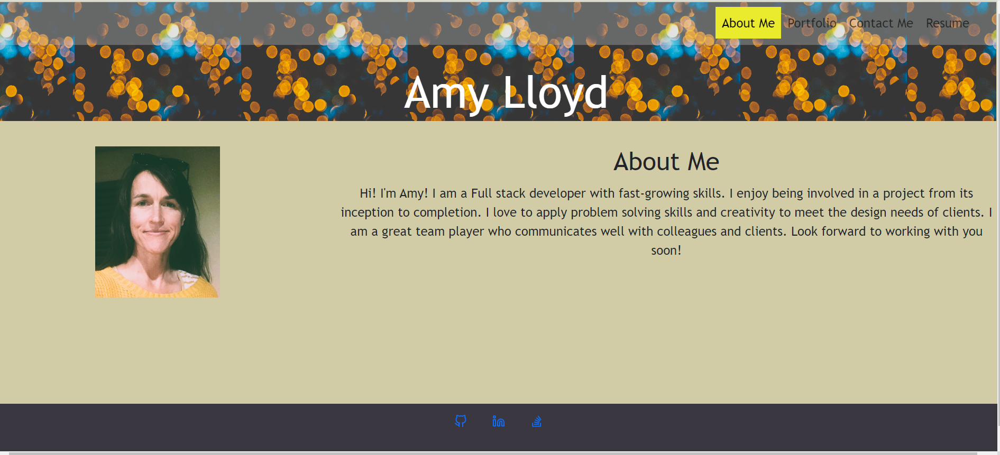

# Portfolio Application

This is a Portfolio website that introduces a developer to future employers and other colleagues in the field. It enables a developer to show their expertise through a portfolio of work that is easily accessible by links. The Contact opens a quick line of communication so that there is no delay or lost email addresses. The contact form includes error messages to the user so they understand how to fix their contact form submission.

## Table of Contents
- [Features](#features)
- [Technologies](#teachnolgies)
- [Usage](#usage)
- [Contribution](#contribution)

## Features
- Downloadable resume
- React structure and components

## Technologies Used

- Front-end: HTML, CSS, JavaScript, React

## Usage

1. Open the application in your web browser at: https://loquacious-sorbet-06e30f.netlify.app/

2. Read the About me. 
3. Fill in the contact form to get in touch through the Contacts page. 
4. Explore my recent projects using the links on the Portfolio Page. 
5. Download the resume for future reference!

## Contribution

If you would like to contribute to this project, please follow these steps:

1. Fork the repository
2. Create a new branch: `git checkout -b feature/your-feature-name`
3. Make your changes and commit them: `git commit -m "Add your message here"`
4. Push to the branch: `git push origin feature/your-feature-name`
5. Open a pull request

